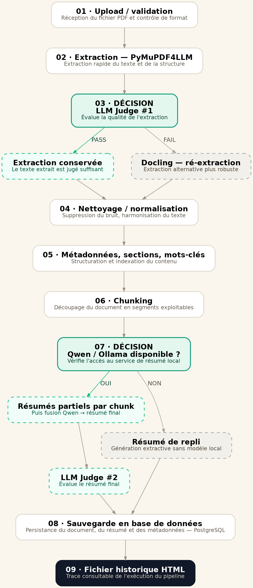
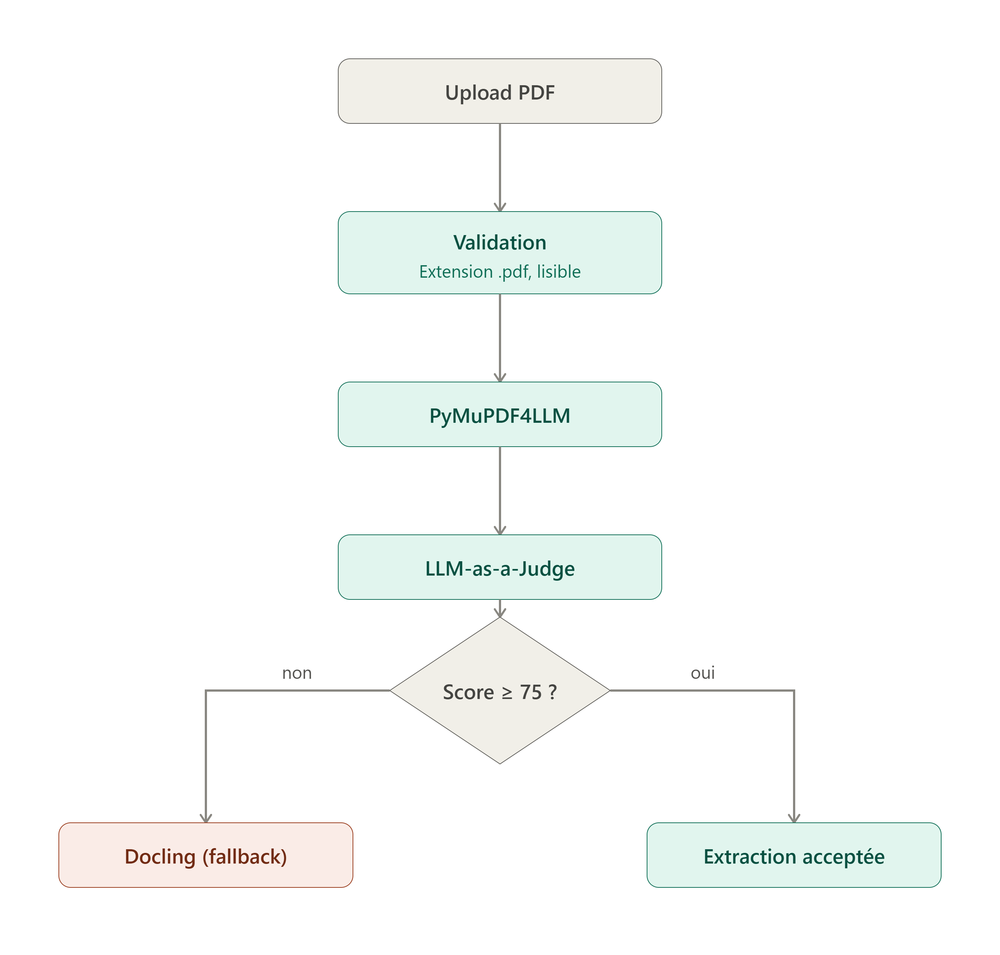
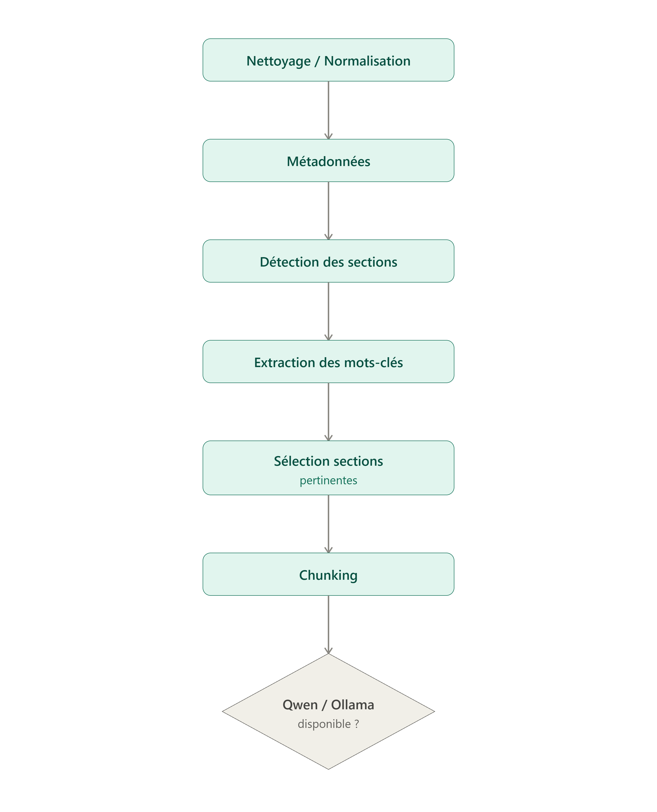
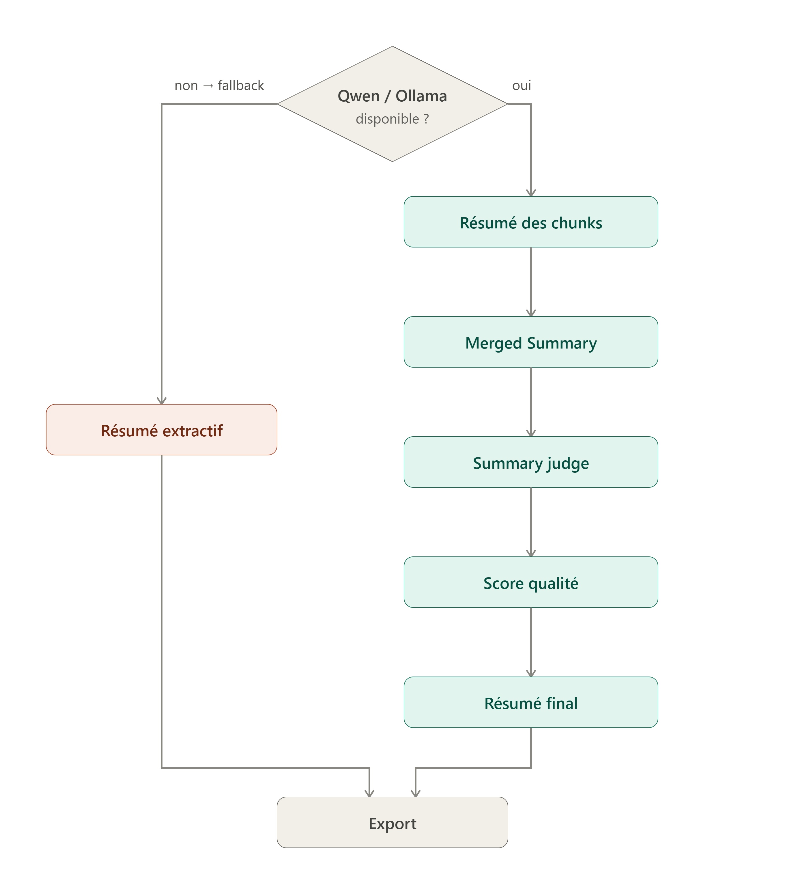
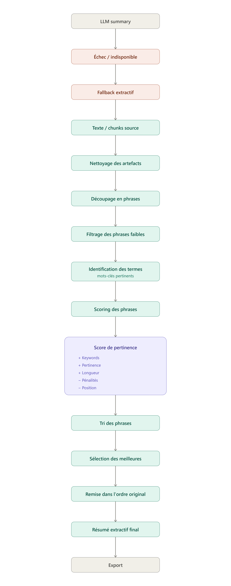

<p align="center">
  
</p>

<h1 align="center">📄 AI Pipeline for Automatic PDF Extraction and Summarization</h1>

<p align="center">
  <em>Internship Project — Team07-E26 · Developed at Yonnov'IA</em>
</p>

<p align="center">
  
  
  
</p>

# 📄 AI Pipeline for Automatic PDF Extraction and Summarization

> **Internship Project — Team07-E26**
> Developed at **Yonnov'IA**

## 📌 Project Overview

This project aims to develop an intelligent AI pipeline for processing scientific PDF documents, from document upload and extraction to preprocessing, automatic summarization, quality evaluation, fallback mechanisms, data persistence, and result export.

The pipeline is designed to process different types of scientific documents, including text-based PDFs and documents containing scanned or OCR-based content.

The system combines conventional document-processing techniques with Large Language Models (LLMs) to improve the reliability and quality of the generated results.

A quality evaluation mechanism is integrated after the initial PDF extraction. The extracted content is evaluated using an **LLM-as-a-Judge**. When the extraction quality is considered insufficient, the pipeline automatically switches to **Docling** as a fallback extraction engine.

After extraction, the document passes through a preprocessing stage including text cleaning and normalization, metadata extraction, section detection, keyword extraction, relevant section selection, and chunking.

The processed chunks are then used for LLM-based summarization through **Qwen and Ollama**. The generated partial summaries are merged into a global summary and evaluated using a dedicated **Summary Judge**.

A deterministic **extractive summarization fallback** is also available when the LLM-based summarization process is unavailable or fails.

The project was developed as part of an AI internship following the **CRISP-DM methodology**, with a focus on building a modular, robust, and extensible document-processing pipeline.

---

## 🎯 Project Objectives

The main objective is to transform scientific PDF documents into structured and exploitable information while providing automatic quality control at different stages of the pipeline.

### General Objective

Develop an intelligent document-processing pipeline capable of extracting, structuring, summarizing, evaluating, and exporting scientific PDF documents.

### Specific Objectives

- Validate uploaded PDF documents before processing.
- Verify file extension and readability.
- Extract textual content from scientific PDF documents.
- Preserve document structure whenever possible.
- Automatically evaluate extraction quality.
- Detect low-quality extractions.
- Use Docling as a fallback extraction engine when necessary.
- Clean and normalize extracted text.
- Extract document metadata.
- Detect scientific document sections.
- Extract relevant keywords.
- Select relevant sections according to predefined priorities.
- Divide the selected content into appropriate chunks.
- Check the availability of Qwen through Ollama.
- Generate summaries from document chunks.
- Merge partial summaries into a global summary.
- Evaluate generated summaries using an LLM-as-a-Judge.
- Provide an extractive fallback when LLM summarization is unavailable or fails.
- Store document and pipeline execution information in PostgreSQL.
- Export processed results.
- Measure the execution time of the different pipeline stages.

---

## 🏗️ Pipeline Architecture

The complete system is organized into several independent but connected stages.

### Global Pipeline

<p align="center">
  
</p>

The complete processing flow can be summarized as follows:

```text
Upload PDF
    ↓
Validation
    ├── Extension = .pdf
    └── File readable
    ↓
PyMuPDF4LLM
    ↓
LLM-as-a-Judge — Extraction
    ↓
Score ≥ 75/100 ?
    │
    ├── YES → Extraction accepted
    │
    └── NO → Docling (Fallback)
                    ↓
          Cleaning / Normalization
                    ↓
                Metadata
                    ↓
          Section Detection
                    ↓
          Keyword Extraction
                    ↓
       Relevant Section Selection
                    ↓
                 Chunking
                    ↓
          Qwen / Ollama available?
              │
              ├── YES
              │    ↓
              │  Chunk Summarization
              │    ↓
              │  Merged Summary
              │    ↓
              │  Summary Judge
              │    ↓
              │  Quality Score
              │    ↓
              │  Final Summary
              │
              └── NO → Extractive Fallback
                              ↓
                         Final Summary
                              ↓
                            Export
```

---

### 1️⃣ PDF Extraction Pipeline

The first stage is responsible for receiving and validating the uploaded document before extracting its content.

<p align="center">
  
</p>

**Processing Flow**

```text
Upload PDF
    ↓
Validation
    ├── Extension = .pdf
    └── File readable
    ↓
PyMuPDF4LLM
    ↓
LLM-as-a-Judge
    ↓
Score ≥ 75 ?
    ├── YES → Extraction accepted
    └── NO  → Docling (Fallback)
```

**Validation**

Before processing, the uploaded file is checked to ensure that:

- the file has a PDF extension;
- the file can be read;
- the upload can be safely stored.

The system uses a dedicated document identifier and controlled storage directories.

**Primary Extraction**

The first extraction engine is PyMuPDF4LLM. Its output is then evaluated automatically rather than being blindly accepted.

**Extraction Quality Evaluation**

An LLM-as-a-Judge evaluates the extracted content. A score threshold of 75/100 is used to determine whether the extraction can continue.

```text
Score ≥ 75
    ↓
Extraction accepted

Score < 75
    ↓
Docling fallback
```

**Fallback Extraction**

When the initial extraction does not reach the required quality threshold, the system switches to Docling. This mechanism allows the pipeline to continue processing documents for which the primary extraction method does not provide satisfactory results.

---

### 2️⃣ Preprocessing Pipeline

After extraction is accepted, the content enters the preprocessing stage.

<p align="center">
  
</p>

The preprocessing pipeline is:

```text
Cleaning / Normalization
        ↓
Metadata
        ↓
Section Detection
        ↓
Keyword Extraction
        ↓
Relevant Section Selection
        ↓
Chunking
```

**Cleaning and Normalization**

The extracted text is cleaned and normalized to reduce extraction artifacts and produce a consistent representation of the document. The objective is to improve the quality of the content without changing its semantic meaning.

**Metadata Extraction**

The system extracts document-level information such as metadata and language information used by subsequent processing stages.

**Section Detection**

The pipeline identifies logical scientific sections such as:

- Abstract
- Introduction
- Related Work
- Methodology
- Experiments
- Results
- Discussion
- Conclusion
- Limitations
- Future Work
- References

The detected sections are then classified according to their role in the processing pipeline.

**Keyword Extraction**

Relevant keywords are extracted from the document. These keywords are useful for characterizing the content and supporting relevance-based processing.

**Relevant Section Selection**

Detected sections are classified according to their priority:

- Core
- Optional
- Excluded
- Unknown

Sections that are explicitly excluded from downstream processing are removed before chunking.

**Chunking**

The relevant sections are divided into manageable chunks before being sent to the LLM. The chunking process uses a controlled maximum size and overlap between consecutive chunks in order to preserve contextual continuity.

---

### 3️⃣ Summarization Pipeline

Once the document has been preprocessed and chunked, the summarization stage is executed.

<p align="center">
  
</p>

The summarization flow is:

```text
Chunking
    ↓
Qwen / Ollama available?
    │
    ├── YES
    │    ↓
    │  Summary of chunks
    │    ↓
    │  Merged Summary
    │    ↓
    │  Summary Judge
    │    ↓
    │  Quality Score
    │    ↓
    │  Final Summary
    │
    └── NO
         ↓
    Extractive Fallback
```

**Qwen / Ollama Availability**

Before starting LLM inference, the system checks whether the configured Qwen model is available through Ollama.

```text
Qwen / Ollama available?
       ├── YES → LLM summarization
       └── NO  → Extractive fallback
```

**Chunk Summarization**

Each relevant chunk is processed by the configured Qwen model:

```text
Chunk 1 → Qwen
Chunk 2 → Qwen
Chunk 3 → Qwen
...
```

This approach avoids sending the entire document to the LLM in a single request.

**Merged Summary**

The partial summaries are then combined into a global summary.

```text
Summary 1
    +
Summary 2
    +
Summary 3
    +
...
    ↓
Merged Summary
```

**Summary Judge**

The merged summary is evaluated by a dedicated Summary Judge. The purpose is to assess the quality of the generated summary according to predefined criteria.

```text
Merged Summary
      ↓
Summary Judge
      ↓
Quality Score
      ↓
Final Summary
```

---

### 4️⃣ Extractive Summarization Fallback

When the LLM summarization process is unavailable or fails, the system uses a deterministic extractive summarization mechanism.

<p align="center">
  
</p>

The fallback follows this process:

```text
LLM Summary
     ↓
Failure / Unavailable
     ↓
Extractive Fallback
     ↓
Source Text / Chunks
     ↓
Artifact Cleaning
     ↓
Sentence Segmentation
     ↓
Weak Sentence Filtering
     ↓
Relevant Term Identification
     ↓
Sentence Scoring
     ↓
Relevance Score
     ↓
Sentence Ranking
     ↓
Best Sentence Selection
     ↓
Restore Original Order
     ↓
Final Extractive Summary
     ↓
Export
```

**Sentence Scoring**

The fallback does not generate new text. Instead, it evaluates existing sentences according to relevance signals such as:

- keyword relevance;
- semantic relevance;
- sentence length;
- penalties for undesirable content;
- sentence position.

The highest-scoring sentences are selected and then restored to their original document order.

> Extractive summarization selects relevant sentences from the source document instead of generating new information. This provides a deterministic alternative when the LLM cannot be used.

---

## 🗃️ Data Persistence

The backend uses PostgreSQL to persist document information, pipeline execution history, preprocessing results, inference information, and generated summaries.

The database is accessed through SQLAlchemy.

### Main Stored Entities

**Documents** — the `documents` table stores:
- document identifier
- filename
- original filename
- storage path
- processing status
- creation timestamp
- update timestamp

**Pipeline Runs** — the `pipeline_runs` table stores:
- pipeline execution identifier
- associated document
- execution status
- model information
- start time
- completion time
- execution duration
- failure stage
- error information

**Extraction Results** — the `extraction_results` table stores:
- extraction method
- extraction quality score
- extraction decision
- page count
- extraction report

**Preprocessing Results** — the `preprocessing_results` table stores structured preprocessing artifacts, including:
- article metadata
- keywords
- detected sections
- missing sections
- selected sections
- filtered sections
- chunks
- cleaning report

**Inference Runs** — the `inference_runs` table stores:
- model information
- inference status
- request count
- completed request count
- failed request count
- inference duration
- inference configuration
- result metadata
- error information

**Summaries** — the `summaries` table stores:
- final summary text
- structured summary JSON
- creation timestamp
- update timestamp

---

## 🔐 Security and Data Privacy

The current implementation includes basic security and confidentiality controls for document processing.

### Current Protections

- Uploaded files are validated before processing.
- Uploaded files are stored in controlled directories.
- Temporary files are removed if the upload operation fails.
- Documents can be deleted through the API.
- Associated pipeline executions and stored results can also be deleted.
- Generated output files can be removed during document deletion.
- Internal filesystem paths are not exposed through the public document listing.
- Internal extraction paths are sanitized from public extraction reports.
- The LLM runtime can operate locally through Ollama.

### Deployment-Level Security

Additional security measures should be configured when deploying the system on shared infrastructure. These may include:

- authentication and authorization;
- HTTPS/TLS;
- restricted database access;
- secure environment-variable management;
- filesystem permissions;
- network isolation;
- controlled access to the LLM runtime;
- database backup and retention policies;
- monitoring and logging policies.

These controls depend on the final deployment infrastructure and are therefore considered part of the deployment phase.

---

## 📊 Performance Monitoring

Execution timing has been added to the pipeline to measure processing duration and identify the main sources of latency.

The timing mechanism can be used to monitor stages such as:

- Upload
- PDF extraction
- preprocessing
- LLM inference
- summary generation
- Judge evaluation
- Markdown export
- PDF export

Initial local performance tests were performed on a development machine with limited GPU resources. The measurements therefore provide a local performance baseline rather than final production performance.

The processing time does not depend only on the number of pages. It can also depend on:

- number of detected sections;
- number of selected sections;
- number of chunks;
- chunk size;
- context size;
- number of generated tokens;
- number of LLM calls;
- model size;
- available CPU/GPU resources.

The LLM inference and Judge stages are currently the main components to monitor for latency optimization.

---

## ⚙️ Configuration

The backend centralizes its configuration through environment variables.

Example configuration:

```env
APP_NAME=PDF Summarization Backend
APP_VERSION=0.1.0

API_HOST=0.0.0.0
API_PORT=8000

SUMMARY_MODEL=qwen2.5vl:7
LLM_JUDGE_MODEL=qwen2.5vl:7b
SUMMARY_JUDGE_MODEL=qwen2.5vl:7

OLLAMA_HOST=http://localhost:11434

OLLAMA_TEMPERATURE=0.2
OLLAMA_TOP_P=0.9
OLLAMA_NUM_PREDICT=2000
OLLAMA_NUM_CTX=8192

DATABASE_URL=postgresql://<user>:<password>@<host>:<port>/<database>
```

The model configuration can be adapted according to the resources available on the target infrastructure.

---

## 🛠️ Technology Stack

| Category | Technologies |
|---|---|
| Programming Language | Python |
| Backend Framework | FastAPI |
| PDF Extraction | PyMuPDF4LLM, Docling |
| OCR / Vision Processing | Qwen Vision / OCR-based processing |
| Extraction Quality Evaluation | Qwen Vision / LLM-as-a-Judge |
| Summarization | Qwen |
| LLM Runtime | Ollama |
| Natural Language Processing | spaCy, Regular Expressions |
| Keyword Extraction | TF-IDF |
| Database | PostgreSQL |
| ORM | SQLAlchemy |
| Data Formats | Markdown, JSON, PDF |
| Configuration | Environment Variables / python-dotenv |
| Version Control | Git & GitHub |
| Methodology | CRISP-DM |

---

## 📂 Repository Structure

```text
Team07-E26/
│
├── README.md
├── requirements.txt
│
├── backend/
│   ├── app/
│   │   ├── api/
│   │   │   ├── routes/
│   │   │   └── dependencies.py
│   │   │
│   │   ├── core/
│   │   │   ├── config.py
│   │   │   └── constants.py
│   │   │
│   │   ├── db/
│   │   │   ├── database.py
│   │   │   └── models.py
│   │   │
│   │   ├── models/
│   │   │   └── response_models.py
│   │   │
│   │   └── services/
│   │       ├── extraction/
│   │       ├── preprocessing/
│   │       ├── summarization/
│   │       ├── quality/
│   │       └── export/
│   │
│   ├── uploads/
│   └── outputs/
│
├── images/
│   ├── full_pipeline.png
│   ├── yonnovia_pdf_extraction_pipeline.png
│   ├── yonnovia_preprocessing_pipeline.png
│   ├── yonnovia_summary_pipeline.png
│   └── yonnovia_extractive_fallback_pipeline.png
│
└── references/
```

> The exact repository structure may evolve as the backend and deployment architecture are further integrated.

---

## ⚙️ Installation

### 1. Clone the repository

```bash
git clone https://github.com/YonnProjetJuiAou26/Team07-E26.git
cd Team07-E26
```

### 2. Install Python dependencies

```bash
pip install -r requirements.txt
```

### 3. Install and configure Ollama

Install Ollama and make sure the Ollama service is running.

The required Qwen models should then be available locally according to the project configuration. The exact model configuration can be adapted according to the available hardware resources.

### 4. Configure PostgreSQL

Create a PostgreSQL database and configure the connection using the `DATABASE_URL` environment variable.

Example:

```env
DATABASE_URL=postgresql://<user>:<password>@<host>:<port>/<database>
```

### 5. Configure environment variables

Create a `.env` file in the appropriate backend location and configure:

```env
SUMMARY_MODEL=qwen2.5:3b
LLM_JUDGE_MODEL=qwen2.5vl:7b
SUMMARY_JUDGE_MODEL=qwen2.5:3b
OLLAMA_HOST=http://localhost:11434
DATABASE_URL=postgresql://<user>:<password>@<host>:<port>/<database>
```

---

## 🚀 Usage

The complete processing workflow follows these steps:

1. Upload a scientific PDF document.
2. Validate the file extension.
3. Verify that the uploaded file is readable.
4. Extract the document using PyMuPDF4LLM.
5. Evaluate extraction quality using the LLM-as-a-Judge.
6. If the score is below 75/100, switch to Docling.
7. Clean and normalize the extracted content.
8. Extract document metadata.
9. Detect document sections.
10. Extract relevant keywords.
11. Select relevant sections.
12. Divide the selected content into chunks.
13. Check Qwen/Ollama availability.
14. Generate summaries for the chunks.
15. Merge the partial summaries into a global summary.
16. Evaluate the global summary using the Summary Judge.
17. Use the extractive fallback if LLM summarization is unavailable or fails.
18. Persist pipeline results in PostgreSQL.
19. Export the final results.

---

## 📊 Current Results

The current implementation provides the following capabilities:

- PDF upload
- PDF validation
- file readability validation
- PDF extraction using PyMuPDF4LLM
- extraction quality evaluation
- Docling fallback
- text cleaning and normalization
- metadata extraction
- scientific section detection
- keyword extraction
- relevant section selection
- chunking
- Qwen-based summarization
- Ollama integration
- merged summary generation
- summary quality evaluation
- deterministic extractive summarization fallback
- PostgreSQL persistence
- pipeline execution history
- Markdown export
- PDF export
- JSON responses
- execution timing and performance monitoring
- basic security and data-privacy controls

---

## 📈 Performance Considerations

Because LLM inference is computationally intensive, performance depends strongly on the available hardware.

Local tests were initially conducted using limited GPU resources. These tests were primarily used to identify bottlenecks and compare the execution time of the different pipeline stages.

The main latency sources are expected to be:

- LLM-based summarization;
- LLM-based extraction evaluation;
- Summary quality evaluation.

Traditional processing stages such as upload, cleaning, section detection, keyword extraction, and export generally have significantly lower computational requirements.

The target deployment infrastructure can therefore be used to improve inference performance by providing more CPU, RAM, and GPU resources.

---

## 🗺️ Project Roadmap

### ✅ Completed

- PDF validation
- PDF extraction
- Extraction quality evaluation
- Docling fallback
- Text cleaning and normalization
- Metadata extraction
- Scientific section detection
- Keyword extraction
- Relevant section selection
- Chunking
- Qwen-based summarization
- Merged summary generation
- Summary quality evaluation
- Extractive summarization fallback
- PostgreSQL persistence
- Markdown export
- PDF export
- JSON responses
- Pipeline execution timing
- Initial security and data-privacy validation

### 🔄 In Progress / Deployment

- Integration on shared server infrastructure
- Resource configuration for production deployment
- Performance optimization on target infrastructure
- Authentication and authorization
- Production security configuration
- Deployment monitoring
- Further model and prompt optimization

---

## 👥 Team

**Organization:** Yonnov'IA
**Project:** Team07-E26

### Team Members

- [Firas Foued](https://github.com/foued-firas)
- [Khouloud Cherif](https://github.com/khouloudcherif-ai)
- [Karim Moalla](https://github.com/mohamedkarimmoalla-cmyk)

*Developed during an AI internship focused on intelligent document processing and scientific article summarization.*

---

## 📚 References

- [PyMuPDF4LLM](https://pymupdf.readthedocs.io/)
- [Docling](https://github.com/DS4SD/docling)
- [Ollama](https://ollama.com/)
- [Qwen](https://github.com/QwenLM/Qwen)
- [Qwen2.5-VL](https://github.com/QwenLM/Qwen2.5-VL)
- [spaCy](https://spacy.io/)
- [Scikit-learn](https://scikit-learn.org/)
- [SQLAlchemy](https://www.sqlalchemy.org/)
- [PostgreSQL](https://www.postgresql.org/)
- [FastAPI](https://fastapi.tiangolo.com/)
- [CRISP-DM Methodology](https://www.datascience-pm.com/crisp-dm-2/)
